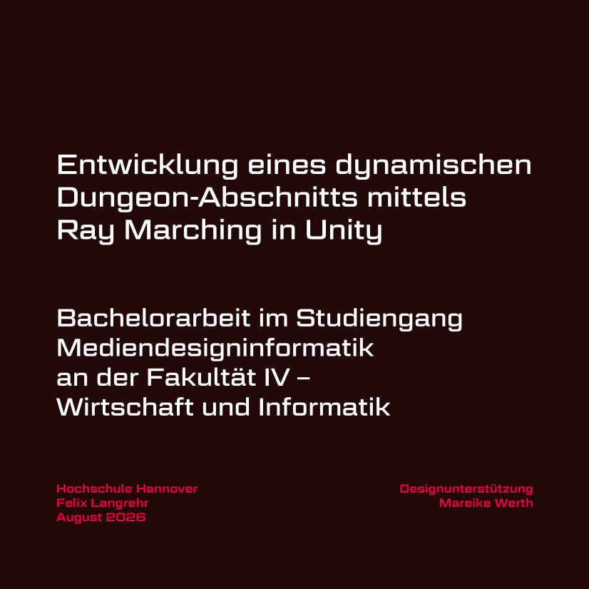
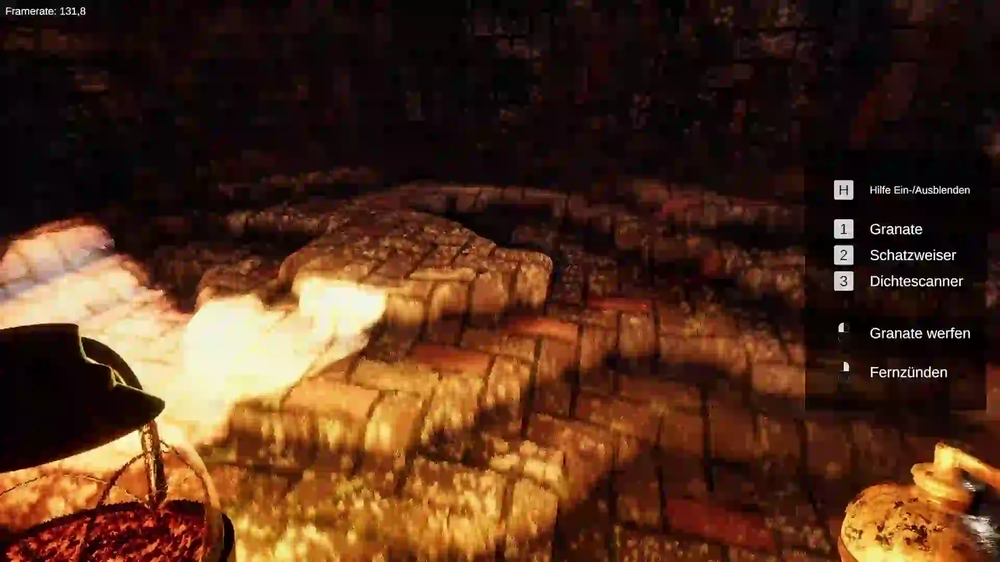
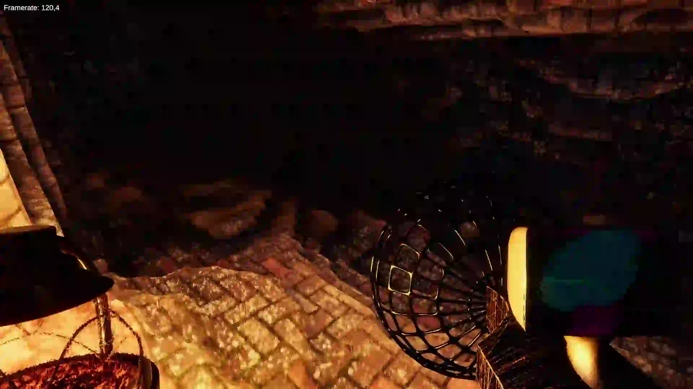
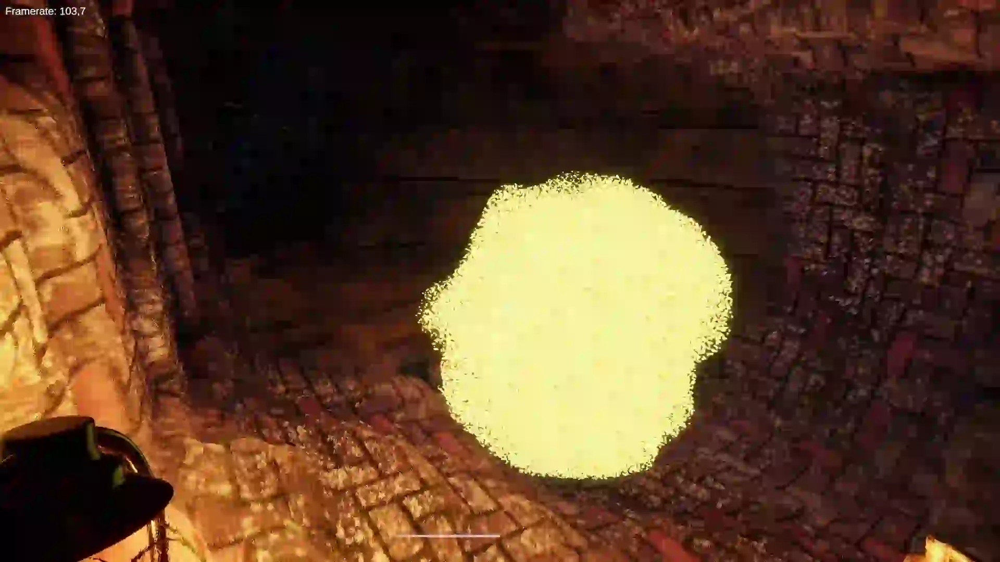

# Bachelor Thesis: 
# "Entwicklung eines dynamischen Dungeon Abschnitts mittels Unity" - Development of a dynamic dungeon segment using Unity
My bachelor thesis from 09/2026 - only available in german, includes written thesis and windows build, no source code. 

**[Read the full thesis (PDF)](./Bachelor-Thesis.pdf)**

> **System:** Windows x86-64  
> **Build:** [Download the latest release](../../releases/latest)

## Impressions / Screenshots
### Changing the dungeons volume with grenades

### Displaying different dungeon materials as x-ray

### The dungeon can regenerate itself in certain spots!

